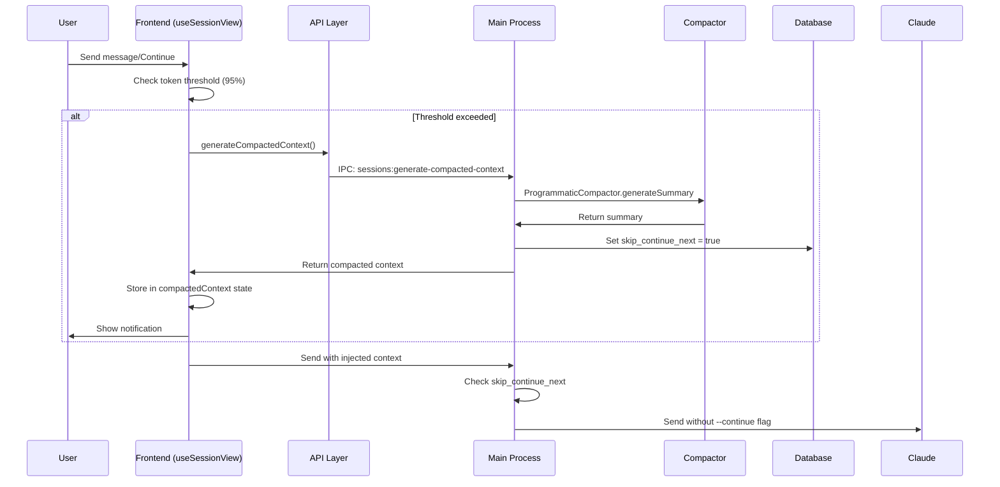

# Auto-Compression at 95% Context Limit
## Product Requirements Document

**Version:** 1.0  
**Date:** January 2025  
**Status:** Draft  
**Owner:** Crystal Development Team  

---

## 1. Executive Summary

This PRD defines the implementation of automatic context compression in Crystal when approaching Claude's token limits. The feature will proactively compress conversation history at 95% of the context window to prevent prompt failures and maintain seamless user experience.

### Key Benefits
- Eliminates "prompt too large" errors
- Provides transparent, automatic context management
- Maintains conversation continuity without user intervention
- Preserves essential context while reducing token usage

---

## 2. Problem Statement

### Current State
- Crystal provides manual context compaction via "Compact Context" button
- Users must manually trigger compression when prompts exceed size limits
- No proactive prevention of oversized prompts
- Users encounter request failures when context exceeds model limits

### Pain Points
- **User Friction:** Manual compression workflow interrupts natural conversation flow
- **Error Prone:** Users experience failed requests due to oversized prompts
- **Data Loss Risk:** Potential for losing work when prompts are rejected
- **Poor UX:** No proactive guidance on context management

---

## 3. Goals & Success Metrics

### Primary Goals
1. **Eliminate Failures:** 100% reduction in "prompt too large" errors
2. **Seamless Operation:** Automatic context management without user intervention
3. **Quality:** Maintain context relevance score >85%

### Success Metrics
- **Error Reduction:** 100% elimination of context size failures
- **User Satisfaction:** 90%+ satisfaction with compression quality
- **Adoption:** Feature triggers automatically without user configuration

---

## 4. User Stories

### Primary User Story
**As a** Crystal user  
**I want** automatic compression when approaching token limits  
**So that** my requests never fail due to oversized prompts  

**Acceptance Criteria:**
- System automatically detects when context approaches 95% of token limit
- Compression occurs transparently before sending request to Claude
- User receives notification that compression occurred
- Conversation continues seamlessly with compressed context

### Secondary User Stories

**Transparency Story**  
**As a** Crystal user  
**I want** to be notified when auto-compression occurs  
**So that** I understand why my conversation context changed  

**Quality Story**  
**As a** Crystal user  
**I want** auto-compression to preserve important context  
**So that** conversation quality remains high  

---

## 5. Functional Requirements

### 5.1 Core Functionality

#### FR-1: Token Threshold Detection
- **Requirement:** Implement 95% token threshold detection in frontend
- **Implementation:** Add preflight token check in `handleSendInput` and `handleContinueConversation` functions
- **Location:** `frontend/src/hooks/useSessionView.ts`
- **Trigger:** Before any request to Claude API

#### FR-2: Automatic Compression Trigger
- **Requirement:** Automatically invoke compression when threshold exceeded
- **Implementation:** 
  - Call existing `API.sessions.generateCompactedContext()` from frontend
  - Utilize existing IPC channel `sessions:generate-compacted-context`
  - Leverage `ProgrammaticCompactor.generateSummary` in main process
- **Flow:**
  ```
  Frontend (useSessionView) → API.sessions.generateCompactedContext() 
  → Electron IPC → Main Process (session.ts) 
  → ProgrammaticCompactor.generateSummary → Database Update
  ```

#### FR-3: Context Injection
- **Requirement:** Inject compressed context into subsequent requests
- **Implementation:** 
  - Store summary in `compactedContext` state
  - Wrap summary in `<session_context>` tags
  - Include in next send/continue operation
  - Set `skip_continue_next = true` to prevent `--continue` flag

### 5.2 User Interface Requirements

#### FR-4: User Notification
- **Requirement:** Notify users when auto-compression occurs
- **Implementation:**
  - Maintain existing terminal banner (yellow text with explanation)
  - Add non-intrusive toast notification in React UI
  - Display token statistics and compression summary

#### FR-5: Visual Feedback
- **Requirement:** Provide clear indication of compression status
- **Implementation:**
  - System output with `subtype: 'context_compacted'`
  - Rendered in terminal via existing `RichOutputView.tsx`
  - Toast appears near input area for immediate feedback

---

## 6. Technical Requirements

### 6.1 Architecture Overview

#### Compression Pipeline


### 6.2 Implementation Details

#### Frontend Components
- **File:** `frontend/src/hooks/useSessionView.ts`
- **Functions:** `handleSendInput`, `handleContinueConversation`, `handleCompactContext`
- **State:** `contextCompacted`, `compactedContext`
- **API:** `frontend/src/utils/api.ts` - `generateCompactedContext()`

#### Main Process Components
- **IPC Handler:** `main/src/ipc/session.ts` - `sessions:generate-compacted-context`
- **Compactor:** `main/src/utils/contextCompactor.ts` - `ProgrammaticCompactor.generateSummary`
- **Session Manager:** `main/src/services/claudeCodeManager.ts` - `continueSession`
- **Database:** `skip_continue_next` flag management

#### Token Estimation
- **Requirement:** Lightweight token estimator for 95% threshold
- **Note:** Crystal lacks central token counting utility
- **Implementation:** Frontend-based estimation with model-specific limits

### 6.3 Data Flow

1. **Preflight Check:** Frontend estimates tokens before API call
2. **Compression Trigger:** If ≥95%, invoke compression pipeline
3. **Data Collection:** Main process gathers session data, messages, outputs
4. **Summary Generation:** `ProgrammaticCompactor` creates compressed context
5. **State Update:** Set `skip_continue_next = true`, emit system output
6. **Context Injection:** Next request includes `<session_context>` summary
7. **Fresh Start:** Main process starts new session without `--continue`

---

## 7. Implementation Plan

### Phase 1: Core Infrastructure (Week 1-2)
- [ ] Add token threshold detection in `useSessionView.ts`
- [ ] Implement preflight check in `handleSendInput` and `handleContinueConversation`
- [ ] Create lightweight token estimator
- [ ] Test compression trigger mechanism

### Phase 2: Integration & Flow (Week 2-3)
- [ ] Ensure proper state management (`compactedContext`, `contextCompacted`)
- [ ] Verify context injection in subsequent requests
- [ ] Test `skip_continue_next` behavior in `claudeCodeManager.ts`
- [ ] Validate end-to-end compression pipeline

### Phase 3: User Experience (Week 3-4)
- [ ] Add toast notification for auto-compression
- [ ] Maintain existing terminal banner functionality
- [ ] Implement error handling and fallback mechanisms
- [ ] User acceptance testing and feedback integration

### Phase 4: Testing & Refinement (Week 4)
- [ ] Comprehensive testing across different session types
- [ ] Performance optimization and monitoring
- [ ] Documentation and user guidance
- [ ] Production deployment preparation

---

## 8. Acceptance Criteria

### AC-1: Automatic Operation
- [ ] Auto-compression triggers at exactly 95% token threshold
- [ ] Compression occurs before API request to Claude
- [ ] `skip_continue_next` flag properly set and cleared
- [ ] Context injection works in subsequent requests
- [ ] No manual user intervention required

### AC-2: User Experience
- [ ] Users receive clear notification when compression occurs
- [ ] Terminal banner displays compression information
- [ ] Toast notification appears for immediate feedback
- [ ] No interruption to conversation flow

### AC-3: Quality & Reliability
- [ ] Compressed context maintains conversation relevance
- [ ] No data loss during compression process
- [ ] Graceful error handling if compression fails
- [ ] Fallback to original prompt if needed
- [ ] 100% elimination of "prompt too large" errors

---

## 9. Risk Assessment

### Technical Risks
- **Token Estimation Accuracy:** Frontend estimation may not match Claude's exact counting
  - *Mitigation:* Use conservative estimates, test with various content types
- **Compression Quality:** Auto-compression may lose important context
  - *Mitigation:* Leverage existing `ProgrammaticCompactor` proven in manual flow

### User Experience Risks
- **Notification Fatigue:** Too many notifications may annoy users
  - *Mitigation:* Use subtle toast, maintain existing terminal approach
- **Context Loss Awareness:** Users may not understand what was compressed
  - *Mitigation:* Clear messaging about compression scope and retention

---

## 10. Dependencies

### Internal Dependencies
**Frontend:**
- `frontend/src/hooks/useSessionView.ts`
- `frontend/src/utils/api.ts`
- `frontend/src/types/electron.d.ts`

**Main Process:**
- `main/src/preload.ts`
- `main/src/ipc/session.ts`
- `main/src/utils/contextCompactor.ts`
- `main/src/services/claudeCodeManager.ts`
- `main/src/database/database.ts`
- `main/src/services/sessionManager.ts`

### External Dependencies
- Claude API token limits and behavior
- Electron IPC communication
- SQLite database for session state

---

## 11. Monitoring & Analytics

### Key Metrics
- **Compression Frequency:** How often auto-compression triggers
- **Error Reduction:** Decrease in "prompt too large" errors
- **User Satisfaction:** Feedback on compression quality
- **Context Relevance:** Quality of compressed summaries

### Monitoring Implementation
- Log compression events with session metadata
- Track token threshold breaches and responses
- Collect user feedback on compression quality

---

## 12. Future Considerations

### Potential Enhancements
- **Smart Compression:** ML-based context importance scoring
- **User Preferences:** Configurable compression thresholds
- **Compression History:** Ability to view/restore previous contexts
- **Multi-Model Support:** Different thresholds for different Claude models

### Scalability
- Consider server-side compression for large deployments
- Implement caching for frequently compressed contexts

---

*This PRD serves as the definitive specification for implementing automatic context compression in Crystal. All development work should align with the requirements and acceptance criteria outlined in this document.*