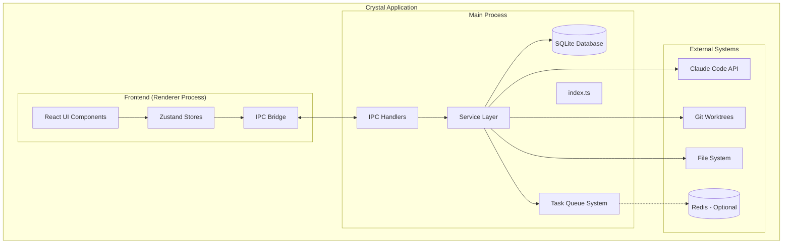
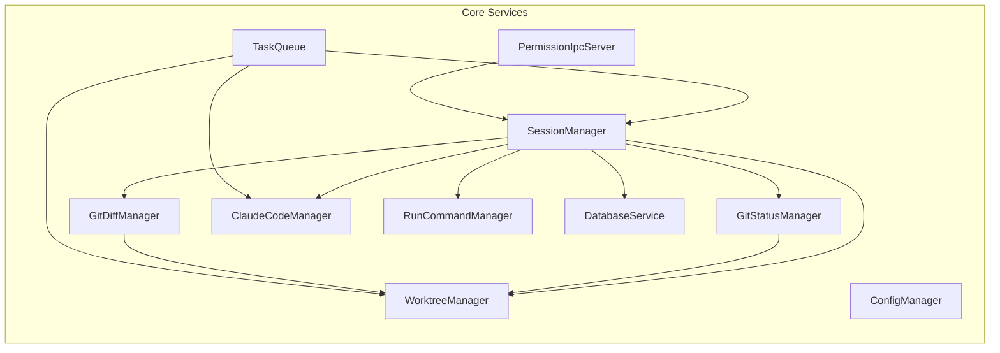
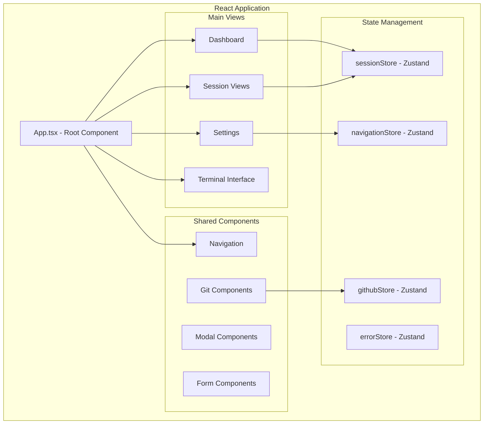
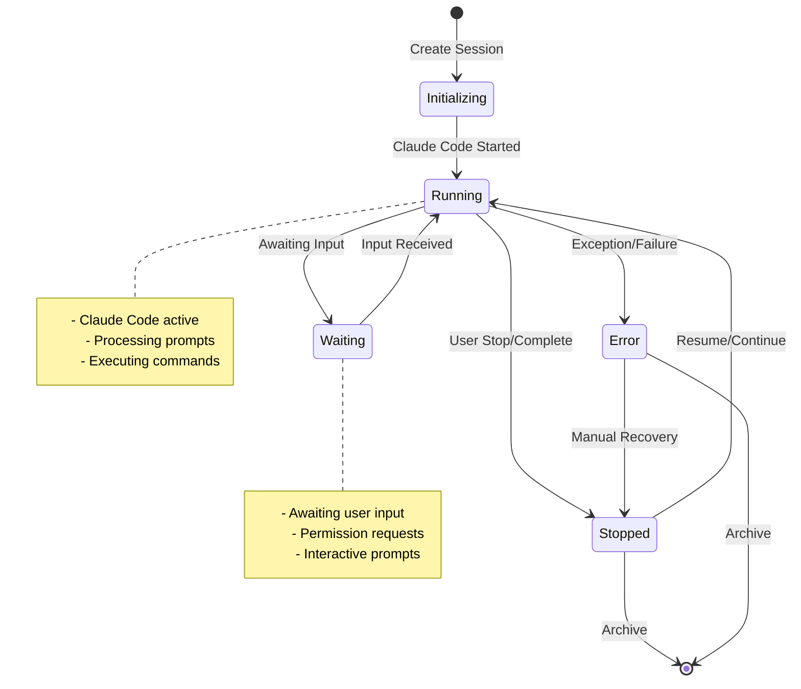
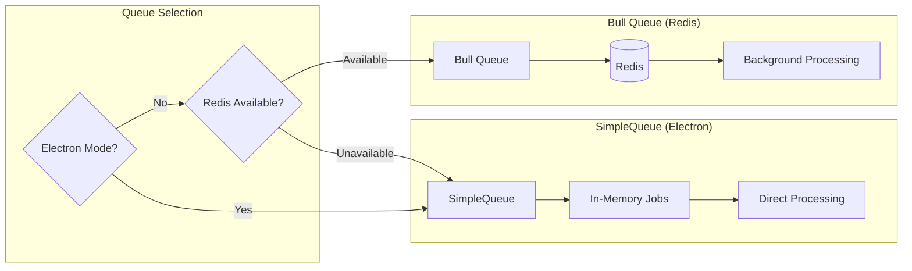
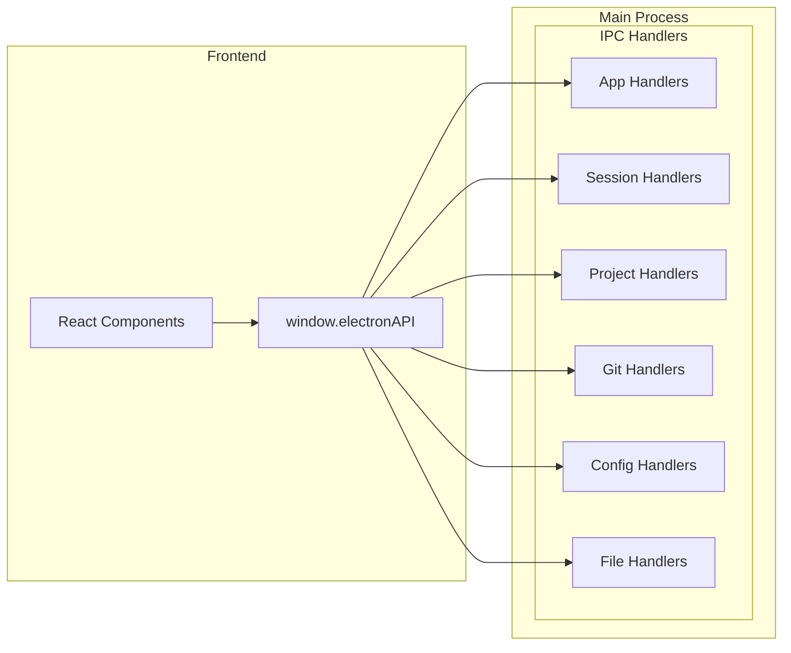

# Crystal Architecture Documentation

Crystal is a multi-session Claude Code Manager built with Electron that enables AI-driven development workflows through isolated Git worktrees and structured session management.

## Table of Contents
1. [High-Level Architecture](#high-level-architecture)
2. [Package Structure](#package-structure)
3. [Main Process Architecture](#main-process-architecture)
4. [Frontend Architecture](#frontend-architecture)
5. [Database Schema](#database-schema)
6. [Session Lifecycle](#session-lifecycle)
7. [Task Queue System](#task-queue-system)
8. [Git Operations](#git-operations)
9. [IPC Communication](#ipc-communication)
10. [State Management](#state-management)
11. [Security Model](#security-model)
12. [Development Workflow](#development-workflow)

## High-Level Architecture

Crystal follows a multi-process Electron architecture with clear separation between the main process (Node.js backend) and renderer process (React frontend).



## Package Structure

The project is organized into three main packages:

```
crystal/
├── docs/                      # Centralized documentation
├── main/                      # Electron main process
│   ├── src/
│   │   ├── database/          # SQLite database layer
│   │   ├── services/          # Core business logic services
│   │   ├── ipc/               # IPC handler registration
│   │   ├── handlers/          # HTTP API handlers (web mode)
│   │   ├── types/             # TypeScript definitions
│   │   ├── utils/             # Utility functions
│   │   ├── index.ts           # Main entry point
│   │   └── server.ts          # HTTP server (web mode)
│   └── package.json
├── frontend/                  # React frontend
│   ├── src/
│   │   ├── components/        # React components
│   │   ├── stores/            # Zustand state stores
│   │   ├── types/             # Frontend type definitions
│   │   ├── utils/             # Frontend utilities
│   │   └── main.tsx           # React entry point
│   └── package.json
└── package.json               # Root workspace configuration
```

## Main Process Architecture

The main process is structured around a service-oriented architecture with clear separation of concerns.

### Core Services



#### Service Descriptions

**SessionManager** (`services/sessionManager.ts`)
- Central hub for session lifecycle management
- Coordinates between database, Git operations, and Claude Code
- Manages terminal sessions and script execution
- Handles session state transitions and events

**WorktreeManager** (`services/worktreeManager.ts`)
- Git worktree creation, deletion, and management
- Branch switching and commit operations
- Worktree path resolution and validation

**GitStatusManager** (`services/gitStatusManager.ts`)
- Real-time Git status monitoring with caching
- Event-driven updates (no polling)
- Handles git diff stats, conflict detection, and branch comparisons
- Optimized for performance with concurrent operation limiting

**ClaudeCodeManager** (`services/claudeCodeManager.ts`)
- Integration with Claude Code API
- Session creation and message routing
- Permission handling and approval workflows

**TaskQueue** (`services/taskQueue.ts`)
- Asynchronous job processing for session creation
- Falls back to SimpleQueue when Redis unavailable
- Handles concurrent session creation with rate limiting

**RunCommandManager** (`services/runCommandManager.ts`)
- Project-specific command execution (RUN commands)
- PTY-based process management with proper cleanup
- Sequential command execution with environment variable injection

### Entry Points

**Main Entry** (`index.ts`)
- Electron app initialization
- Service instantiation and dependency injection
- IPC handler registration
- Event listener setup

**HTTP Server** (`server.ts`)
- Express server for web-based operation
- Mirrors IPC handlers as HTTP endpoints
- Enables Crystal to run outside Electron

## Frontend Architecture

The frontend is built with React 19, TypeScript, and Zustand for state management.

### Component Architecture



### Key Technologies

- **React 19**: Component framework with latest concurrent features
- **TypeScript**: Type safety and developer experience
- **Zustand**: Lightweight state management
- **Tailwind CSS**: Utility-first styling
- **Radix UI**: Accessible component primitives
- **Monaco Editor**: Code editing capabilities
- **xterm.js**: Terminal emulation
- **Mermaid**: Diagram rendering

### State Stores

**sessionStore** - Manages session data and operations
**navigationStore** - UI navigation state
**githubStore** - GitHub integration state
**errorStore** - Global error handling

## Database Schema

Crystal uses SQLite with the following core tables:

```sql
-- Core project and session management
CREATE TABLE projects (
    id INTEGER PRIMARY KEY AUTOINCREMENT,
    name TEXT NOT NULL UNIQUE,
    path TEXT NOT NULL,
    created_at TIMESTAMP DEFAULT CURRENT_TIMESTAMP,
    build_script TEXT,
    run_script TEXT,
    is_main_repo BOOLEAN DEFAULT FALSE,
    main_branch TEXT DEFAULT 'main'
);

-- Session instances
CREATE TABLE sessions (
    id TEXT PRIMARY KEY,
    name TEXT NOT NULL,
    initial_prompt TEXT NOT NULL,
    worktree_name TEXT NOT NULL,
    worktree_path TEXT NOT NULL,
    status TEXT NOT NULL DEFAULT 'pending',
    created_at TIMESTAMP DEFAULT CURRENT_TIMESTAMP,
    updated_at TIMESTAMP DEFAULT CURRENT_TIMESTAMP,
    claude_session_id TEXT UNIQUE,
    project_id INTEGER NOT NULL,
    folder_id TEXT,
    permission_mode TEXT DEFAULT 'approve',
    is_main_repo BOOLEAN DEFAULT FALSE,
    auto_commit BOOLEAN DEFAULT FALSE,
    model TEXT DEFAULT 'claude-3-5-sonnet-20241022',
    base_commit TEXT,
    base_branch TEXT DEFAULT 'main',
    commit_mode TEXT DEFAULT 'structured',
    commit_mode_settings TEXT,
    FOREIGN KEY (project_id) REFERENCES projects (id)
);

-- Terminal output and execution history
CREATE TABLE session_outputs (
    id INTEGER PRIMARY KEY AUTOINCREMENT,
    session_id TEXT NOT NULL,
    output_type TEXT NOT NULL,
    content TEXT NOT NULL,
    timestamp TIMESTAMP DEFAULT CURRENT_TIMESTAMP,
    FOREIGN KEY (session_id) REFERENCES sessions (id)
);

-- Claude conversation messages
CREATE TABLE conversation_messages (
    id INTEGER PRIMARY KEY AUTOINCREMENT,
    session_id TEXT NOT NULL,
    message_type TEXT NOT NULL, -- 'user' or 'assistant'
    content TEXT NOT NULL,
    timestamp TIMESTAMP DEFAULT CURRENT_TIMESTAMP,
    FOREIGN KEY (session_id) REFERENCES sessions (id)
);
```

## Session Lifecycle

Sessions progress through defined states managed by the SessionManager:



## Task Queue System

Crystal implements a dual-queue system for optimal performance:



### Queue Types

1. **Session Creation Queue**: Handles async worktree creation and Claude Code initialization
2. **Input Queue**: Processes user input to active sessions
3. **Continue Queue**: Manages session continuation requests

### Concurrency and Environment

- Queue backend selection:
  - If running inside Electron and REDIS_URL is not set, an in‑process SimpleQueue is used
  - If REDIS_URL is set (or running outside Electron), Bull (backed by Redis) is used
- Concurrency defaults:
  - Session creation: 5 concurrent jobs (reduced to 1 on Linux due to PTY/FD limits)
  - Input: 10 concurrent jobs
  - Continue: 10 concurrent jobs
- Operational logging: job state transitions are logged (active/completed/failed/error)

## IPC Communication

Communication between processes uses Electron's IPC with organized handlers:



### Handler Categories

- **App**: Updates, version info, window management
- **Session**: CRUD operations, execution, terminal
- **Project**: Project management, build/run scripts
- **Git**: Status, diffs, commits, branches
- **Config**: Application settings, preferences
- **File**: File operations, folder management

### Preload Bridge Surface

The preload script exposes a single, namespaced bridge with context isolation enabled. High‑level surface areas include:

- Basic app info: getAppVersion, getPlatform, isPackaged
- Version and auto‑updater: checkForUpdates, getVersionInfo, updater.checkAndDownload/downloadUpdate/installUpdate
- System utilities: openExternal
- Sessions: create/getAll/delete, sendInput/continue/getOutput, gitCommit/gitPull/gitPush/rebase, runScript/runTerminalCommand, openIDE, and more
- Projects: getAll/create/update/delete/activate, detectBranch/listBranches, refreshGitStatus
- Git: detectBranch, cancelStatusForProject
- Folders: CRUD, reorder, move sessions/folders
- Config: get/update
- Prompts: getAll/getByPromptId
- Files: listProject/readProject
- GitHub: getPRs/getIssues/getCIStatus/createFixSession
- Dialog: openFile/openDirectory
- Permissions: respond/getPending
- Stravu OAuth and Notebooks: auth and notebook APIs
- Dashboard: getProjectStatus/getProjectStatusProgressive and update events
- UI State: expanded nodes persistence
- Events: session lifecycle, git status updates, terminal output, main process logs, updater events, zombie process detection

## Security Model

Crystal implements a permission-based security model:

### Permission Modes

1. **Approve Mode**: User approves each file operation
2. **Ignore Mode**: Operations proceed without approval (development)

### MCP (Model Context Protocol) Integration

- Permission server for Claude Code operations
- File access control and monitoring
- Operation logging and audit trail

### Electron Security Hardening

- Renderer created with BrowserWindow webPreferences:
  - contextIsolation: true
  - nodeIntegration: false
  - preload: main/src/preload.js (bridged APIs only)
- External link handling: all window.open/navigation is denied and routed to the OS via shell.openExternal; the app explicitly returns action: 'deny' from setWindowOpenHandler
- In development, DevTools may be enabled by env flags; no relaxation of contextIsolation/nodeIntegration in development

## Development Workflow

### Main Process Development

```bash
# Development with watch mode
cd main
pnpm dev

# Testing
pnpm test
pnpm test:watch
pnpm test:coverage

# Building
pnpm build
```

### Frontend Development

```bash
# Development server
cd frontend
pnpm dev

# Testing
pnpm test

# Building
pnpm build
```

### Key Development Features

- **TypeScript**: Full type safety across packages
- **Hot Reload**: Instant development feedback
- **Testing**: Vitest for unit and integration tests
- **Linting**: ESLint with TypeScript rules
- **Build Tools**: Vite (frontend), tsc (main process)

## Deployment Architecture

Crystal supports multiple deployment modes:

### Electron Desktop App
- Packaged with electron-builder
- Auto-updater integration
- Platform-specific builds (macOS, Windows, Linux)

### Web Application
- Express server mode
- Docker deployment ready
- Redis integration for scaling

This architecture enables Crystal to provide a robust, scalable platform for AI-driven development workflows while maintaining clean separation of concerns and optimal performance characteristics.